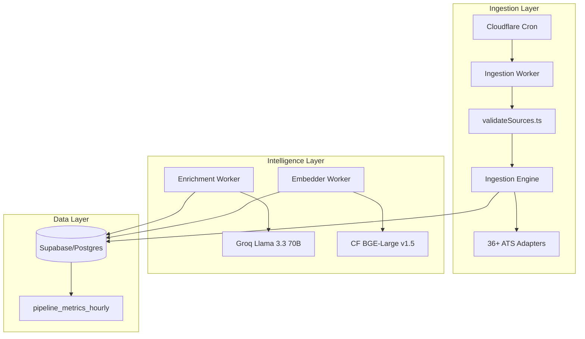

# HireMax Architectural Map — Production Hardened (V6.2)

This document provides a high-fidelity mapping of the HireMax ingestion, enrichment, and intelligence ecosystem.

## 1. System Overview
HireMax is a decoupled, autonomous ingestion pipeline that transforms raw ATS data into high-quality, searchable job insights.

---

## 2. Ingestion Pipeline
**Trigger:** Sequential 10-minute cron triggers partitioned by Tier.

### A. Preflight Health Check (`validateSources.ts`)
- **Action:** Audits upstream source health (Lever, Greenhouse, etc.) BEFORE ingestion.
- **Reliability:** Auto-disables dead sources to prevent "Cursor Ghosting" (advancing offsets on 404s).
- **Observability:** Flushes healthy/dead counts to `pipeline_metrics_hourly`.

### B. Ingestion Engine (`group_processor.ts`)
- **Tiered Processing:** Execution order: `ALPHA` → `BETA` → `GAMMA`.
- **Capacity Gating:** `CapacityManager` enforces strict limits (450 writes/run) to protect DB and respect free-tier constraints.
- **Idempotency:** SHA-256 Fingerprinting (`PersistenceEngine`) ensures 100% duplicate rejection even if source IDs change.

---

## 3. Intelligence Pipeline
Decoupled post-ingestion enrichment and vectorization.

### A. Enrichment (`enrichment.ts`)
- **Model:** `llama-3.3-70b-versatile` (Groq).
- **Control:** Token Bucket Rate Limiter (2400ms interval) to respect free-tier limits.
- **Data:** Classifies Skills (max 10), Seniority, Industry, and Work Type (Remote/Hybrid/Onsite).

### B. Embedding (`embedder.ts`)
- **Model:** `@cf/baai/bge-large-en-v1.5` (1024-dim).
- **Technique:** Smart Field Weighting (Title ×3, Skills ×2, Description ×1) within a 4000-char budget.
- **Storage:** HNSW index (`idx_job_pointers_embedding`) confirmed on Supabase for <100ms semantic search.

---

## 4. Observability & Reliability
- **Metrics:** `public.pipeline_metrics_hourly` provides hourly rollups of throughput, latency, and failure rates.
- **DLQ:** `ingestion_dlq` captures failed payloads for manual audit without stopping the pipeline.
- **Atomic Cursors:** Offset management happens via Supabase RPC `atomic_advance_cursor` to prevent race conditions.

---

## 5. Directory Blueprint
- `infra/workers/`: Entry points and master orchestration.
- `infra/adapters/`: Source-specific logic (Greenhouse, Lever, Workable, etc.).
- `core/ingestion-engine/`: Trusted core logic (Normalization, Persistence, Scoring).
- `core/shared/db/`: Common DB clients and metrics helpers.
