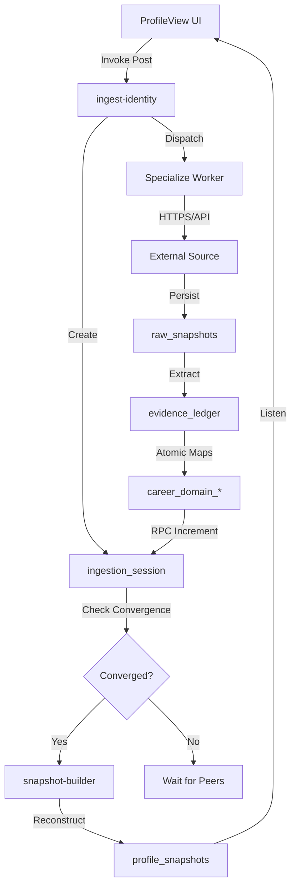

# Data Flow & Execution Graph: Forensic Pipeline

This document maps the sequential and parallel execution paths for professional identity synthesis.

## 1. Execution Graph (Logical)

## 2. Ingestion Timeline (Step-by-Step)

### Step 1: Ingestion Request
The frontend invokes `ingest-identity` with a `source` (e.g., 'LINKEDIN').

### Step 2: Boundary Checking
`ingest-identity` performs:
1. **SSRF Pre-check**: Ensures URL is not internal.
2. **Classification**: Ensures external data is anchored to a known type (e.g., 'SCHOLAR').
3. **Entropy Lock**: Creates a command hash with a 1-hour time epoch to prevent duplicate ingestion spam while allowing fresh syncs.

### Step 3: Worker Handoff
Orchestrator invokes the specific worker (`worker-linkedin`). This handoff is asynchronous. The orchestrator returns `HTTP 202 Accepted` to the UI immediately.

### Step 4: Evidence Extraction
The worker fetches the source data.
- **LinkedIn Worker**: Uses OAuth to fetch profile JSON.
- **External Worker**: Fetches HTML, applies Spoof Guard (blocks generic homepages), and checks text density.
- **Gmail Worker**: Filters for last 30 days and verified employer domains.

### Step 5: Convergent Finality
Upon completion, the worker increments `completed_workers` in `ingestion_sessions`.
- If `completed_workers == expected_workers`, the state is set to `converged`.
- The `snapshot-builder` is then invoked with specific `session_id` context.

### Step 6: Snapshot Synthesis
`snapshot-builder` scans the `career_*` tables and `evidence_ledger`.
- It calculates **Temporal Decay** for skills and roles using `signal-math.ts`.
- It creates an immutable versioned snapshot.

## 3. Control Boundary Analysis
- **UI Control**: Ends at Step 1. UI transitions to "Assembling Evidence" polling state.
- **Orchestration Control**: Step 2 & 3. 
- **Worker Control**: Step 4 & 5. This is where most IO wait occurs.
- **Synthesis Control**: Step 6. Pure mathematical synthesis.
